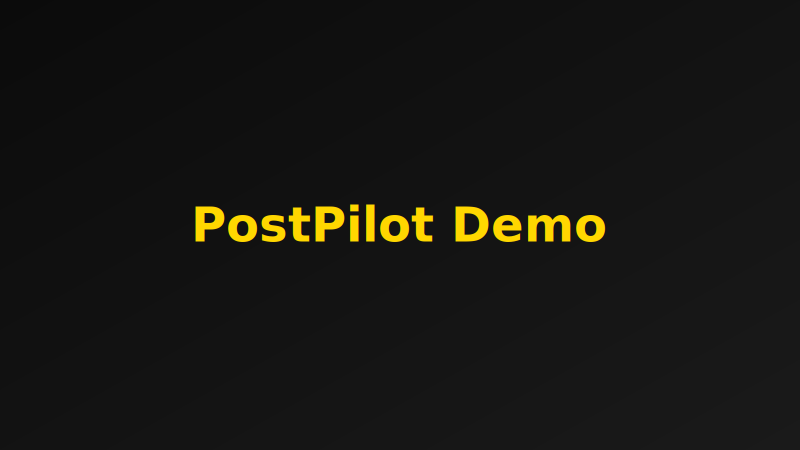
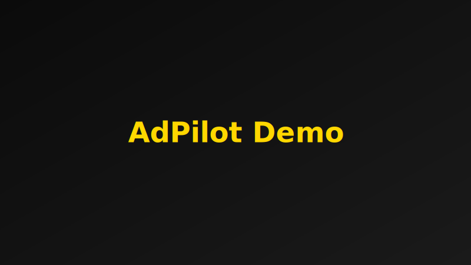
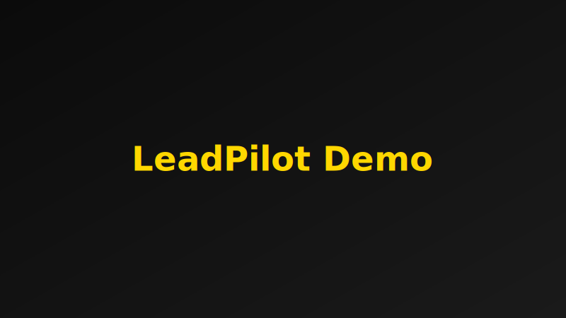
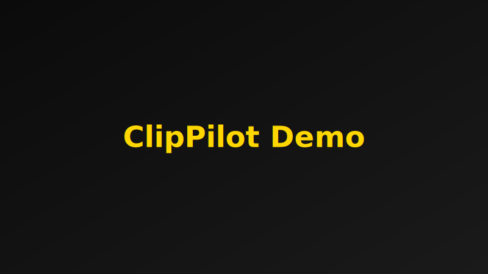

# GrowthPilot

All‑in‑one AI marketing suite built with Next.js 14 and TypeScript. GrowthPilot brings together content generation, video assembly, brand assets, analytics, usage metering, queues, and billing into one cohesive app.

- PostPilot — AI Social Content
- BlogPilot — SEO Blog Writer
- AdPilot — Ads Optimizer
- LeadPilot — Lead Gen Chatbot
- MailPilot — AI Email Writer
- BrandPilot — Brand & Design Kit
- ClipPilot — Video/Shorts Creator


## Tech Stack
- Next.js 14 (App Router), React 18, TypeScript
- MongoDB + Mongoose
- Redis + BullMQ for background jobs and scheduling
- Stripe for subscriptions, metering, and overage invoicing
- AWS S3 for uploads and assets (optional CDN)
- OpenAI (LLMs, Whisper), ElevenLabs (TTS)
- Tailwind CSS, Radix UI, lucide-react


<!-- ## Architecture Highlights -->
<!-- - Plans, modules, and gates
  - Modules and required plan: `lib/modules.ts`
  - Feature gates by plan: `lib/features.ts`, `lib/plan-gate.ts`
- Billing and usage
  - Stripe client + helpers: `lib/stripe.ts`
  - Usage metering helpers: `lib/billing/usage.ts`, `lib/billing/overage.ts`
  - Webhook handler: `app/api/webhooks/stripe/route.ts`
- Queues and workers
  - BullMQ connection + sample queue: `lib/queue.ts`
  - Admin UI (Bull Board): `app/admin/queues/route.ts`
  - Clip pipeline example: `workers/clip-pipeline.ts`
- AI providers and routing
  - OpenAI client wrapper: `lib/ai.ts`, `lib/provider.ts`
- Media pipeline
  - FFmpeg/FFprobe via static installers or system binaries -->


## Badges


<!-- ## Screenshots
- PostPilot — Social content generator
  - 
- BlogPilot — SEO blog writer
  - 
- AdPilot — Ads optimizer
  - 
- LeadPilot — Lead gen chatbot
  - 
- MailPilot — Email writer
  - 
- BrandPilot — Brand kit
  - 
- ClipPilot — Shorts creator
  -  -->


## Module Tour
<!-- - PostPilot
  - Generate on‑brand social posts with hashtags, tracking optional usage for billing.
  - Entry: `app/postpilot/page.tsx`, API: `app/api/postpilot/generate/route.ts`
- BlogPilot
  - Research and draft SEO‑friendly articles with outlines and facts.
  - Entry: `app/blogpilot/page.tsx`
- AdPilot
  - Create and iterate on high‑performing ad variants.
  - Entry: `app/adpilot/page.tsx`
- LeadPilot
  - Collect leads via a guided chat, optionally post to your webhook.
  - API submit: `app/api/leadpilot/submit/route.ts`, webhook utility: `lib/webhook.ts`
- MailPilot
  - Draft outreach and lifecycle emails with structured prompts.
  - Entry: `app/mailpilot/page.tsx`
- BrandPilot
  - Manage brand assets and generate on‑brand visuals.
  - Entry: `app/brandpilot/page.tsx`
- ClipPilot
  - Auto‑clip long videos into shorts with captions and aspect variants.
  - Pipeline example: `workers/clip-pipeline.ts` -->

## Prerequisites
- Node 18+
- MongoDB (local or Atlas)
- Redis (local or managed)
- FFmpeg/FFprobe available (ffmpeg-static/ffprobe-static are used in some paths; you can override via env)
- Stripe account (test/live), AWS S3 bucket, OpenAI key, and optionally ElevenLabs


## Quick Start
1) Copy environment template and fill in values:
```
cp .env.example .env
```
2) Install dependencies:
```
pnpm install   # or npm install / yarn
```
3) Run the web app (http://localhost:3000):
```
pnpm dev
```
4) Start background workers as needed (in separate terminals):
```
# Clip pipeline worker (shorts assembly)
pnpm dlx tsx -r tsconfig-paths/register scripts/clip-worker.ts

# (Example) Clip pipeline: import and integrate with your queue
# See workers/clip-pipeline.ts for an end‑to‑end example function.
```
5) Queue admin UI (requires Redis):
```
# Open at http://localhost:3000/admin/queues
pnpm run queues:ui
```

## Testing
- `pnpm test` — run the entire Vitest suite headlessly.
- `pnpm vitest run tests/adpilot/generate.test.ts` — exercise the AdPilot API module in isolation (mocks OpenAI/auth/db so it’s safe to run locally).
- `pnpm vitest run tests/mailpilot/generate.test.ts` — run the MailPilot generator tests (ensures auth, usage gating, and spam scoring don’t regress).
- Extend `tests/` with similar specs per module to keep coverage focused and fast; Vitest picks up any `*.test.ts` under that directory.


## Environment Variables
<!-- See `.env.example` for the full list and defaults. Minimum set for local dev:
- Auth: `NEXTAUTH_URL`, `AUTH_SECRET`
- Database: `MONGODB_URI`, `MONGODB_DB`
- Stripe: `STRIPE_SECRET_KEY`, `STRIPE_WEBHOOK_SECRET`
- Storage: `AWS_REGION`, `S3_BUCKET` (+ IAM: `AWS_ACCESS_KEY_ID`, `AWS_SECRET_ACCESS_KEY`)
- Redis: `REDIS_URL` (or `REDIS_HOST`, `REDIS_PORT`, `REDIS_PASSWORD`)
- AI: `OPENAI_API_KEY` (and optionally `ELEVENLABS_API_KEY`)
- App: `NEXT_PUBLIC_APP_URL` -->

<!-- Optional/advanced:
- Upstash rate limit: `UPSTASH_REDIS_REST_URL`, `UPSTASH_REDIS_REST_TOKEN`
- Model routing overrides: `*_MODEL` keys
- FFmpeg overrides: `FFMPEG_PATH`, `FFPROBE_PATH`
- Webhooks: `CLIPS_WEBHOOK_SECRET`, `LEADPILOT_WEBHOOK_URL` -->


<!-- ## Billing and Webhooks -->
<!-- - Checkout and portal endpoints under `app/api/billing/*`
- Stripe webhook: `app/api/webhooks/stripe/route.ts`
  - Set `STRIPE_WEBHOOK_SECRET` and configure the endpoint in your Stripe dashboard.
  - Handles checkout completion, subscription updates, and invoicing hooks.
- Usage metering (per tokens/minutes) via `lib/billing/usage.ts` with safe guards.
- Overage invoicing support in `jobs/overage-invoice.ts`. -->


<!-- ## Queues and Workers
- BullMQ queues (Redis) are used for scheduling and background processing.
- Admin dashboard is served at `/admin/queues` when the app is running.
- Example ClipPilot worker script: `scripts/clip-worker.ts`
- Example video clip pipeline: `workers/clip-pipeline.ts` (ffmpeg/whisper, captions, S3 upload).
 -->

<!-- ## Development Tips
- Lint and types:
```
pnpm lint
pnpm typecheck
```
- Diagnose ffmpeg availability by visiting a diagnostic route you add or set `FFMPEG_PATH`/`FFPROBE_PATH`.
- Use `NEXT_PUBLIC_DEV_UNLOCK_ALL=true` during local exploration to bypass module plan gates. -->


<!-- ## Deployment Notes
- Set production envs securely in your platform dashboard. Do not commit `.env`.
- See `docs/GO_LIVE.md` for a production checklist: secrets, billing setup, security, and operations.
- Ensure proper CORS/CSP and restrict origins to `NEXT_PUBLIC_APP_URL` in production.
- Configure a CDN (`CDN_URL`) if serving large media from S3. -->


<!-- ## Security
- Never commit secrets. Use `.env.example` as a template only.
- Rotate keys if any secret is exposed. Push protection will block commits containing common secret formats. -->


<!-- ## Troubleshooting
- Push blocked due to secrets: remove the secret from history (e.g., `git filter-repo`) and rotate the key.
- Webhook signature errors: confirm `STRIPE_WEBHOOK_SECRET` and use raw request body in your platform.
- Redis connection issues: set `REDIS_URL` or `REDIS_HOST/PORT/PASSWORD` and ensure the service is reachable.
- FFmpeg errors on Windows: set `FFMPEG_PATH` and `FFPROBE_PATH` to installed binaries. -->


## License
Proprietary. All rights reserved.
